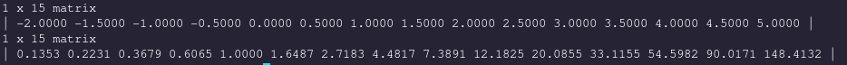

# Functional

`Functional` is an incomplete submodule that provides basic routines commonly associated with a functional paradigm of programming. For example, in `matrix_functional.h` you'll find routines like `filter`, `map`, `head`, `tail`, `last`, and `init`. This module also contains the implementation of three common functions: `Id`, `x^2`, and `x^3`. Because we don't have lambda functions in C, we have no mechanism to define a function in the middle of our calling code. Therefore, we can reference the identity function `ID`, x squared `x_squared`, and x cubed `x_cubed`.

### Map
Use `map` to return a newly allocated vector whose elements `y_i = f(x_i)`, that is the function applied to each element of an input `Vector`.

`map` is a _higher order function_ which accepts a ` TYPED(Vector)*` and a function with the signature `double (* function) (double)`. Note that this means that the function we pass in as argument has to be defined somewhere and visible to the calling scope. For example, if we have included the `math.h` library then we can use `exp` with `map` since `exp` is a function that maps a double to a double.

Here's an example where we apply the function `exp` to the `15` equally spaced points between `[-2, 5]`
```
 TYPED(Vector)*v = TYPED(asrow)(linspace(-2, 5, 15));
 TYPED(Vector)*v_exp = map(v, exp);
```
<!-- Which outputs: -->

### Apply

Whereas `map` returns a newly allocated vector, `apply` is a convenient function that can be used to apply a function and modify the result in-place.

If, for example, we are stringing together multiple functions, then we can use `apply` to avoid creating an anonymous matrix.

```
 TYPED(Vector)*v = apply(range(1, 10, 2), exp)
```

This function call applies the exponential function and modifies the vector that was returned by `range` in-place, avoiding an extra matrix getting allocated for no reason.

### Filter

As the name suggests, `filter` allows us to select only the elements from a given vector that meet our criteria. Just like `map`, `filter` is a higher-order function that accepts a ` TYPED(Vector)*` and a function that accepts a `double` and returns a `bool`. Yes! This time our function returns a `bool` - known as the `predicate`. `filter` will iterate along a vector and only pull out the elements that return `true` when passed to the `predicate`.

Let's see this in action to better understand whats going on.
```
 TYPED(Vector)*v = TYPED(Vector_rnorm)(15, 0, 1);
```
We generate a new `Vector` whose elements are normally distributed. Let's define somewhere in our file a new function that returns true if `|x| > 1`, meaning that `x` is outside the standard deviation of our distribution.

```
// somewhere else
// #include <stdbool.h>
bool outside_std(double x) {
    return x < -1 || x > 1;
}
```

Armed with this new function we can pull out the elements that are not within 1 standard deviation of `0`.

```
 TYPED(Vector)*outliers = TYPED(filter)(v, outside_std);
```

We can filter the elements that return `false` when evaluated by the predicate with `filter_if_not`:

```
 TYPED(Vector)*values = filter_if_not(v, outside_std);
```


### Named functions
Named functions are useful to pass as arguments to higher order functions like `map`.
###### Id
The identity function is in this module is `Id`

```
double x =TYPED(Id)(3.0); // x = 3.0
```

<!-- One interesting way to use the identity function is to clone a matrix: -->

###### x_squared

We have named `f(x) = x^2` in C as `x_squared`.

###### x_cubed

`f(x) = x^3` is named `TYPED(x_cubed)`.
