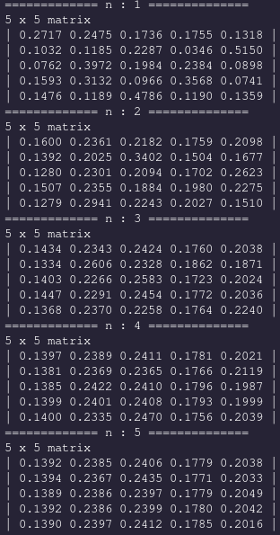
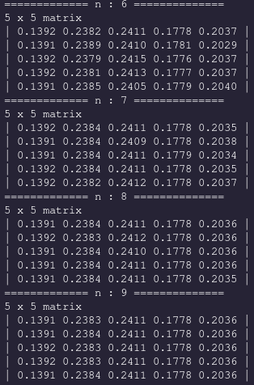
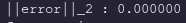

# Stochastic

<!-- This submodule was a natural evolution after taking a stochastic processes class that focused on the evolution of mo -->
This submodule contains essential functions that deal with stochastic processes - models that are driven by a probablistic process. One common object of study in this field are Markov Chains and stochastic matrices.

### Stochastic Matrices

A stochastic matrix - sometimes called a transition matrix - is by convention a right-multiplied square matrix whose row sums are all equal to 1 and whose elements are all positive. A stochastic matrix completely describes a Markov Chain. Important to the theory of Stochastic matrices is a stationary probability vector - a row vector whose elements sum up to 1 which is unaffected by right multiplication of the stochastic matrix; it is an eigenvector with eigenvalue 1.

### Construction

We can construct a new randomly generated stochastic matrix whose elements are sampled from the usual distributions with: `Stochastic_runif`, `Stochastic_rnorm`, `Stochastic_rexp`. These functions work by first randomly generating an `n x n` matrix whose elements are independently sampled from a usual distribution. Next, iterating along the rows we normalize the elements so that they all add up to 1 using the utility function `as_stochastic_matrix`.

```
Matrix *s_unif = Stochastic_runif(5, 0, 10);
Matrix *s_norm = Stochastic_rnorm(5, 0, 1);
Matrix *s_exp = Stochastic_rexp(n, a, b);
```

It's important to note that the final elements of the stochastic matrix won't have the same scaling factor as the distributions parameters passed in as arguments. For example, if we call `Stochastic_runif(5, 0, 10)`, it is evidently impossible to have elements that are greater than 1. Thus, the parameters of the underlying distribution that will truly be reflected in the resulting stochastic matrix is the spread.

*Editor's note:* I'll actually have to run some experimentation and verify these results because I hypothesize that repeated calls to `Stochastic_runif(5, 0, 10)` will generate the same overall distribution as `Stochastic_runif(5, 0, 1)`. I'm not quite sure how the other distributions will behave, however.

### Utility functions

There are a number of utility function provided in this model that may be of interest to the user. We start off by introducing the functions `as_row_stochastic` and `as_col_stochastic`, which both take in a `Matrix *` as their only parameter. As suggested by their title, these functions will normalize the elements of the matrix so that there `row` or `col` sums are equal to 1, respectively. The helper function `as_stochastic` does the same thing as `as_row_stochastic` except this time it calls `apply(m, fabs)` to the matrix before normalizing. `as_row_stochastic` and `as_col_stochastic` make the implicit assumption that the elements are already positive.

```
Matrix *m = TYPED(Matrix_runif)(5, 5)


```

There are a few important things to consider with these functions. Following the conventions of this project and the standard practice of constant correctness, the fact that these functions accept a `Matrix *` as their argument and not a `const Matrix *` suggests to the user that the functions will modify the referenced `Matrix`. Additionally, although it is theoretically fundamental that a stochastic matrix is square, these functions do not verify that. Nor do `as_row_stochastic` and `as_col_stochastic` bother to check whether or not all of the elements are positive. Thus these functions could have instead been called `normalize_row/col_sums` or something to that effect, but I chose the names `as_stochastic` to communicate their intent to be used as a helper function in the higher level `Stochastic_xxx` or `TYPED(Matrix_as_stochastic)` routines.

### Doubly Stochastic Matrix

A doubly stochastic matrix is a sqaure matrix with all positive entries whose rows and columns all individually sum up to 1. Thus this can be considered both a right and left stochastic matrix simultaneously. We can use the low level routine `as_doubly_stochastic` to convert any (even rectangular) matrices to a matrix of the same size whose elements are iteratively normalized so that both the row and column sums converge to 1. Without any experimental evidence, I claim that this routine converges "fairly quickly" - an analysis wholly unsatisfactory from a mathematician's perspective but enough for me. I enjoyed writing this function because in order to implement it I needed the notion of a `distance` function between two vectors (i.e. the error) which is contently residing in the `matrix_linear` submodule.

### Stationary Vectors

The magic of Stochastic matrices and the markov chains that they describe arise when we detail the convergence (or lack thereof) of repeated right hand multiplications. In other words, raising the stochastic matrix to the nth power. Under certain conditions which will be revealed throughout the rest of the semester, this repeated multiplication will converge.

Theoretical result: the row space of this convergent matrix are the stationary vectors of the original stochastic matrix. Let's check out an example.

```C
Matrix *A = Stochastic_runif(5, 0, 1);

for (int i = 0; i < 10; i++) {
    Matrix *temp = TYPED(Matrix_pow)(A, i);
    TYPED(Matrix_print)(temp);
    TYPED(Matrix_reset)(&temp);
}
```

This snippet of code will print the successive powers of the stochastic matrix *m. We will see that the convergence happens quite rapidly:




For this small matrix, convergence passes the eyeball test. The row space of this matrix is thus the set of all stationary vectors, which we declare to be the span of the first row, `r = {0.1391 0.2383 0.2411 0.1778 0.2036}`

We test that this is indeed a stationary vector by computing `rA`, and then finding the distance (error) between `r` and `rA`.

```
 TYPED(Vector)*r = TYPED(Matrix_get_row)(A, 0);
 TYPED(Vector)*rA = TYPED(Matrix_multiply)(r, A);

printf("||error||_2 = %lf\n", TYPED(Vector_distance)(r, rA));
```



To be transparent, we acheived this low of an error by extracting the stationary vector via `A^50`, not `A^10`.

