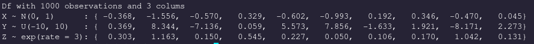
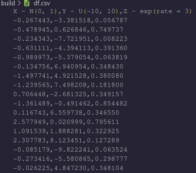
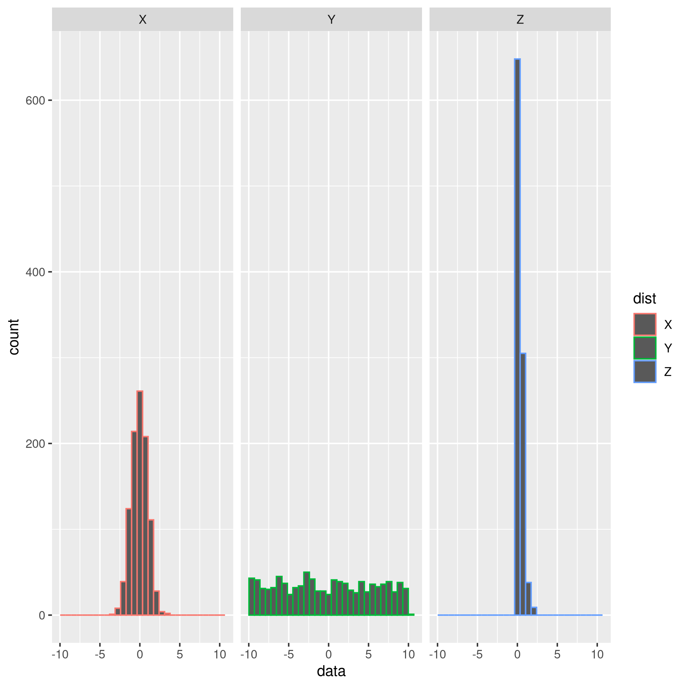

### DataFrame

The `DataFrame` structure allows one to easily store related data, i.e. `Vector`s, in a column-indexed format where each column is linked with a descriptive `String`.

###### Structure

The `DataFrame` is really just a structure with two pointers, one to a `Chain` object and another to a `Space`.

```
typedef struct data_frame_t {

    Chain *chain;
    Space *space;

} DataFrame;
```

Hopefully these names aren't too confusing; A `Chain` is simply a linked list whose data are of type `String`, a `Space` is a linked list of `Vectors` who have the same size.

###### Construction

What's really awesome about `libejovo` is that we can use C's variadic functions to instantiate a `Chain` and `Space` quite easily. For example, imagine that we wanted to study how different distributions behave. We can generate samples of size `n` from a given distribution using the functions defined under the `TYPED(Matrix_dist)` submodule

```
 TYPED(Vector)*rnorm = TYPED(Vector_rnorm)(1000, 0, 1);    // 1000 samples of X ~ N(0, 1)
 TYPED(Vector)*runif = TYPED(Vector_runif)(1000, -10, 10); // 1000 samples of X ~ U(-10, 10)
 TYPED(Vector)*rexp  = TYPED(Vector_rexp) (1000, 3);     // 1000 samples of an exponential distribution with rate parameter `3`
```

We can easily wrap these three `Vector`s up into a `Space` in two different ways. Either we can manually add them one by one:

```
Space *root = newSpace(rnorm);
appendSpace(root, runif);
appendSpace(root, rexp);
```

Or, we can make use of variadic functions to instantiate a Space object in one line. To do so, we **MUST** pass the `Vector` count as the first argument of `newSpaceVar`:

```
Space *root_alt = newSpaceVar(3, rnorm, runif, rexp);
```
Here for example we indicate that there are `3` vector arguments. We can similarly create a new `Chain` object with `newChainVar`, passing `const char*` strings as arguments:

```
Chain *data_desc = newChainVar(3, "X ~ N(0 1)", "Y ~ U(-10 10)", "Z ~ exp(rate = 3)");
```
- **Don't** put commas in the names of your columns or you risk ruining the structural integrity of the _comma_-separated value format, as I've just learned from experience...

We can then unify the data into a `DataFrame`:

```
DataFrame *df = newDataFrame(data_desc, root_alt);
printDataFrame(df);
```



###### Exportation

Notice how there are 1000 observations, with 3 columns each. If we want to visualize this data set with a statistical software package, we can first convert to a comma-separated value file, `.csv`, using the function: `writeCSV`.

```
writeCSV(df, "df.csv");
```

The data will then be stored in the proper format to interface with other software suites.



* Note: The data in this set differs from the previous image only because they were taken on successive executions and the RNG produces different experiments each time.

Renaming the variables and using the `pivot_longer` function in `R` (that I am *not* going to even try and compete with, btw) allows us to create the pretty graphic with `ggplot2`, visualizing the different distributions:



- The y-axis captures counts, and gives us no indication of the magnitude of the observed variables
- The x-axis shows the ranges of values that observations of X, Y, and Z fall into