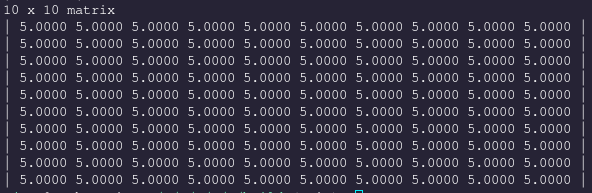
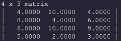
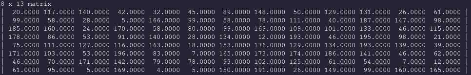
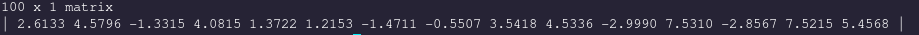
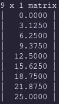
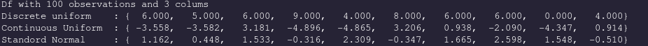
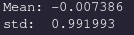

## Libejovo

This library is a scientific library that represents a comprehensive summary of the applied mathematics that I've learned at engineering school. The internals of the library revolve around the `Matrix` data structure that allows a unified and simple approach to allocating memory for arrays, accessing elements, and interacting with the data from a high-level approach.

### Goals

This project is an organic application of the concepts that I'm studying. It's intent is to master and internalize the fundamental routines of scientific computing, establish good habits, practice writing documentation for an audience, aquiring an intimate understanding of the difficulties of implementing numeric routines, deepen the application side of the mathematics, master the C programming language, and much much more.

### Bite-sized Introduction

This section will _briefly_ introduce the user-facing functions that are used to dictate `Matrix` operations. For more information, see [matrix](Matrix/matrix.md).

###### Instantiation

To allocate the memory for a new, fixed-size `double` container called a `Matrix`, call `TYPED(Matrix_new)`:
```
Matrix *m = TYPED(Matrix_new)(10, 4); // Create a 10 x 4 matrix full of zeros
```

`TYPED(Matrix_new)(10, 4)` creates a new `10 x 4` matrix - a matrix with 10 rows and 4 columns whose every element is 0. The function returns a pointer because the new `Matrix` is in charge of a (potentially) large block of memory and must be freed appropriately upon deconstruction. Notice how `TYPED(Matrix_new)` addopts a sort of OOP approach where an object `Matrix` performs a verb `new`. Pay attention to this pattern as it will guide the philosophy for the user-facing API provided in this library.

###### Releasing Memory

Equally important as allocating memory is freeing it. Use the function `TYPED(Matrix_free)` to release the memory associated with a matrix.

```
TYPED(Matrix_free)(m); // Does not nullify m
```

This function will release the memory both held by the pointer pointing to the matrix's data and by the memory pointed to by `m` itself. Since we only pass in `m` and not the address of `m`, this function cannot actually nullify `m` after freeing the memory associated, and it is therefore in violation of CERT's security standards. We reccomend calling `TYPED(Matrix_reset)` to free **all** of the memory controlled by `m` and to nullify the pointer `m` afterwords.

Consider:

```
TYPED(Matrix_reset)(&m); // Nullifies m
```

###### Constructors

We can create a new constant `Matrix` whose every element is `k` with `TYPED(Matrix_value)`:

```
m = TYPED(Matrix_value)(10, 10, 5); // Create a 10 x 10 matrix of all 5s
```

Print a `Matrix` with `TYPED(Matrix_print)`. Notice again the noun-verb combination.

```
TYPED(Matrix_print)(m);
```



We can create an `m` by `n` `Matrix` whose elements are sampled from an iid uniform distribution of integers belonging to `{0, ... , 10}` with `TYPED(Matrix_rand)(m, n)`

```
TYPED(Matrix_reset)(&m);

m = TYPED(Matrix_rand)(4, 3);
TYPED(Matrix_print_fixed)(m); // %6.4lf as format descriptor

```



or belonging to `{a, ... , b}` with `TYPED(Matrix_random)(m, n, a, b)`

```
TYPED(Matrix_reset)(&m);

m = TYPED(Matrix_random)(8, 13, 0, 200);
TYPED(Matrix_print_fixed)(B); // %6.4lf format descriptor per element

TYPED(Matrix_reset)(&m);
```



A `Vector` is a type-alias for a `Matrix` that communicates _intent_ of working with a `Matrix` that is a 1-dimensional column (or row) vector.

We can create a new `Vector` that is a sample from the Normal distribution `X ~ N(a, b)`:

```
 TYPED(Vector)*v = TYPED(Vector_runif)(100, -3, 8);
```

The default output of most `Vector` constructors is a column vector (a `Matrix` whose `nrows == 1`). We can print the first `n` elements with the `TYPED(Vector_print_head)(A, n)` function
```
TYPED(Vector_print_head)(v, 15);
```



Super important and frequent in scientific applications is the beloved `linspace`, implemented with the function `TYPED(Vector_linspace)(start, end, n)`:

```
TYPED(Matrix_reset)(&v);

v = TYPED(Vector_linspace)(0, 25, 9);
TYPED(Matrix_print)(v);

TYPED(Matrix_reset)(&v);
```



Note that `n` in the call to `linspace` is the size of the resulting `Vector`.

Check out the Constructors section in [Matrix](Matrix/matrix.md) for other ways to construct a Matrix

###### Data Analysis
We can wrap up a series of vectors that have the same length along with a string that gives us a meaningful descriptor of the data into a new structure, the `DataFrame`. Readers who have used `R` or Python's `Pandas` for data science will be familiar with the `DataFrame` in theory and in practice.

Available at our disposal are the fundamental statistics routines to gather information about the data in a `Vector`.

Here we showcase just a few of these functions:

```
double u_v      = mean(v);
double s_v      = std(v);
double min_v    = min(v);
double max_v    = max(v);
double var_v    = var(v);
```

These statistical routines are not prefixed with a unique identifier like `TYPED(Vector_)`. Therefore, we acknowlege that this may change in the future or this might provide namespace conflicts for other projects.

Other routines that are similar but have more use in Linear Algebra will be prefixed:

```
double norm_v   = TYPED(Vector_pnorm)(v, 2);
double norm_v   = TYPED(Vector_inner)(v, v);
 TYPED(Vector)*v_proj  = TYPED(Vector_project_onto)(v, v);
```

###### DataFrame

A `DataFrame` is simply a pointer to a `Chain` (A linked list of `String`s) and a pointer to a `Space` (A linked list of `Vector`s. I chose the word `Space` to evoke the notion of a vector space). We can create a new `Chain` and a new `Space` with the variadic functions `newChainVar(n, ...)` and `newSpaceVar(n, ...)`. The first parameter indicates how many parameters we are passing into the function:

```
int n = 100;

Chain *c = newChainVar(3, "Discrete uniform", "Continuous Uniform", "Standord Normal");
Space *s = newSpaceVar(3, TYPED(Vector_rand)(n), TYPED(Vector_runif)(n, -5, 5), TYPED(Vector_rnorm)(n, 0, 1));

DataFrame *df = newDataFrame(c, s);
printDataFrame(df);
```


Readers familiar with the tidyverse will recognize this presentation. We invite yout to notice the new functional style approach with `newChainVar`, `printDataFrame`, as opposed to `Chain_new_var` and `DataFrame_print`.

We can compute the `mean` of the `nth` (**zero**-based indexing) col of `df` as:

```
printf("Mean: %lf\n", mean(getColDF(df, 2))); // get the THIRD column of df
printf("std:  %lf\n",  std(getColDF(df, 2)));
```



The mean and standard deviation are what we expect from a random variable `X ~ N(0, 1)`. As we increase the size of our vector, `n`, the values will approach 0 and 1.

To export our data in a format that we can plot in Python or R, we use the `createCSV(df, filename)` function:

```
createCSV(df, "df.csv");

```